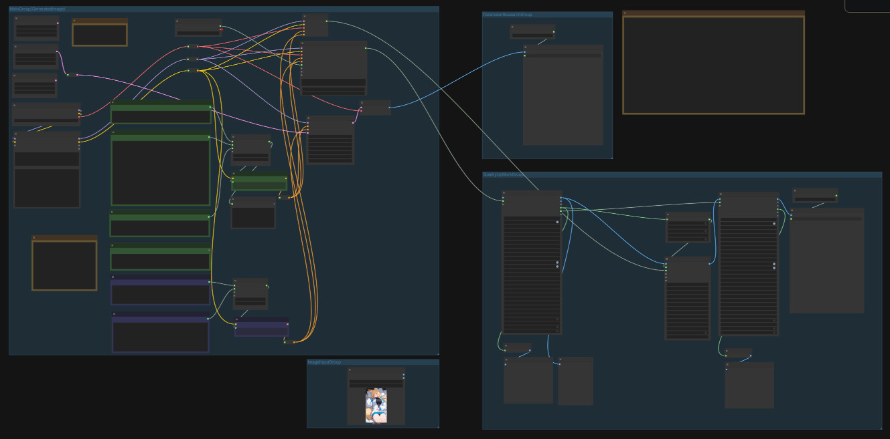
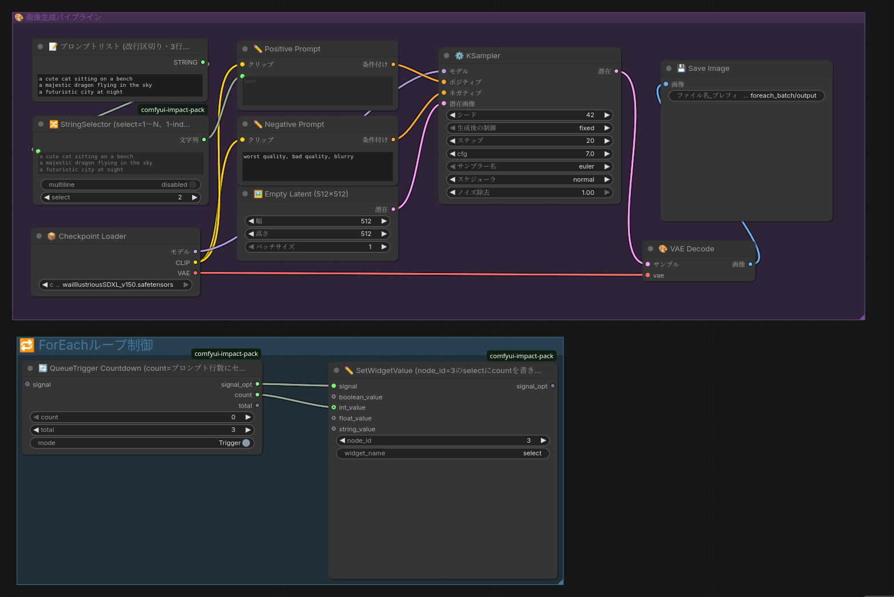

# daisy comfyui workflows

画像生成AIの運用ComfyUI/workflowおよび関連ユーティリティ

# コンテンツ

## illustriousxl-workbed-workflow



ComfyUI/IllustriousXLを用いた画像生成の実用workflow

キャラクタ１名が登場する一連の連続した物語を持つCG集向け画像生成を想定している

プロンプト共通部分に画風・キャラクタを埋めておき、シーン毎にシーン固有のプロンプトを書き換えて画像生成を行う

使い方：

やりたい工程に対して、画像入出力を繋ぎ変えることで対応する

- プロンプト等パラメタを調整しながら画像生成する：「VAEデコーダ」Node出力を「画層を保存」Nodeに繋ぐ
- 画像生成しながら結果画像に高品質化をかける：「VAEデコーダ」Node出力を「FaceDetailer」Nodeに繋ぐ
- 画像ファイルに高品質化をかける：「画像を読み込む」Node出力を「FaceDetailer」Nodeに繋ぐ

## foreach_batch-sample_workflow



ForEachバッチ実行のシンプルなサンプルworkflow

プロンプトリストNodeにセットした文字列を、１行ごとにプロンプトにして画像を生成する

# セットアップ

pre-commitフックをセット

```
cp -p pre-commit .git/hooks/
.git/hooks/pre-commit
```

ワークフローjsonファイルを確認・整形実施(改行を入れる。mdも対象となる)

```
npx prettier --check .
npx prettier --write .
```
